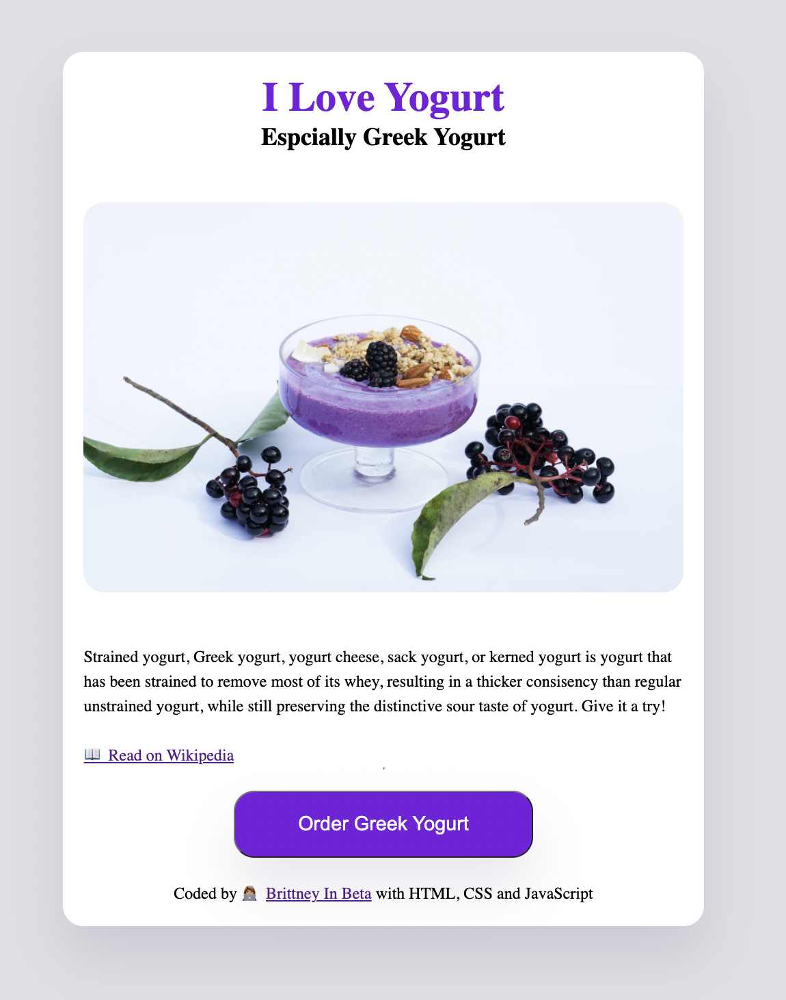
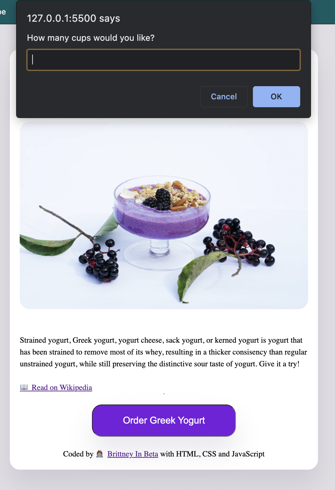

<h1>This is a mini project for beginners.</h1>

Use small projects like this when beginning with HTML, CSS and Javascript to practice concepts. This will help to solidify your understanding.

This project allows the user to "order" greek yogurt. Once the button is clicked an event listener will trigger a function that consist of a series of prompts. The info entered by the user will then be displayed in a quick alert to the user. This info will show them how many orders they placed, their name and the email address their receipt will be sent too.

  

